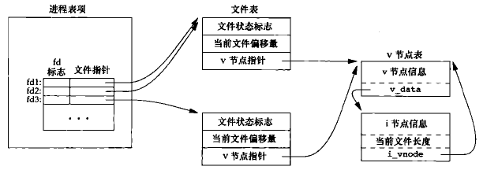

## 3.1 读写磁盘文件时，本章描述的函数确实是不带缓冲机制的吗？

所有磁盘 I/O 都要经过内核的块缓冲区，唯一例外是对原始磁盘的 I/O，但本书不考虑该情况

因此 `read` 和 `write` 当然是要被内核缓冲的，「不带缓冲的 I/O」是指用户进程不会对这两个函数自动缓冲

## 3.2 编写与 dup2 功能相同的函数，要求不使用 fcntl 并有出错处理

## 3.3 假设一个进程指向下面 3 个函数调用，画出结果图；对 fcntl 作用于 fd1 来说，F_SETFD、F_SETFL 分别影响哪个文件描述符？

```c
fd1 = open(path, oflags);
fd2 = dup(fd1);
fd3 = open(path, oflags);
```



`F_SETFD` 只影响文件描述符，因此只影响`fd1`

`F_SETFL` 影响文件表项，因此影响 `fd1`、`fd2`

## 3.4 说明下面 if 语句的必要性，假设 fd 分别是 1 和 3 时文件描述符的变化

```c
dup2(fd, 0);
dup2(fd, 1);
dup2(fd, 2);
if (fd > 2)
    close(fd);
```

该段代码使文件描述符 0、1、2 指向 fd 的文件表项，`if` 代码块可使指向 fd 对应的文件描述符只有 3 个

## 3.5 说明下面两条命令的区别

```c
./a.out > outfile 2>&1
./a.out 2>&1 > outfile
```

shell 从左到右处理命令

第一行：首先 1 指向 outfile，然后 2 指向 1 的文件表项（outfile）

第二行：首先 2 指向 1 的文件表项（标准输出），然后 1 指向 outfile

## 3.6 如果使用追加标志打开文件读写，能否仍用 lseek 进行位置偏移读写？

可以进行偏移读，但写时会自动将偏移量设置为文件尾